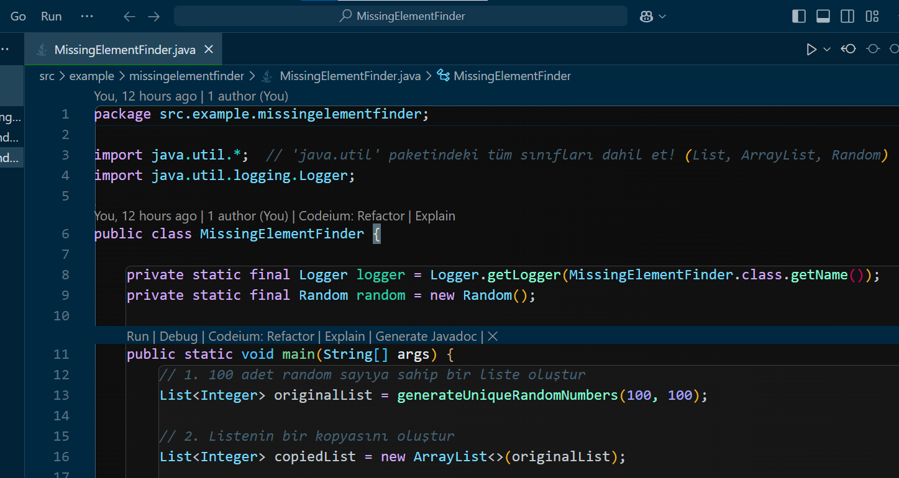
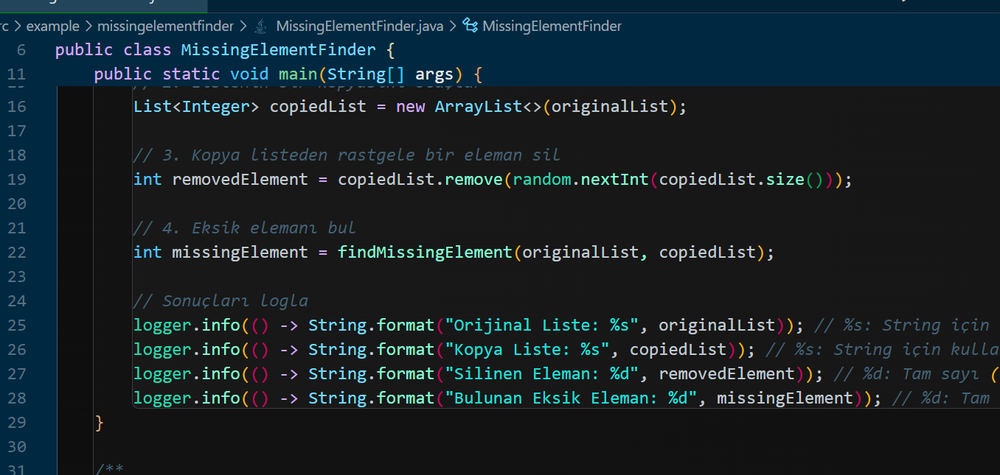
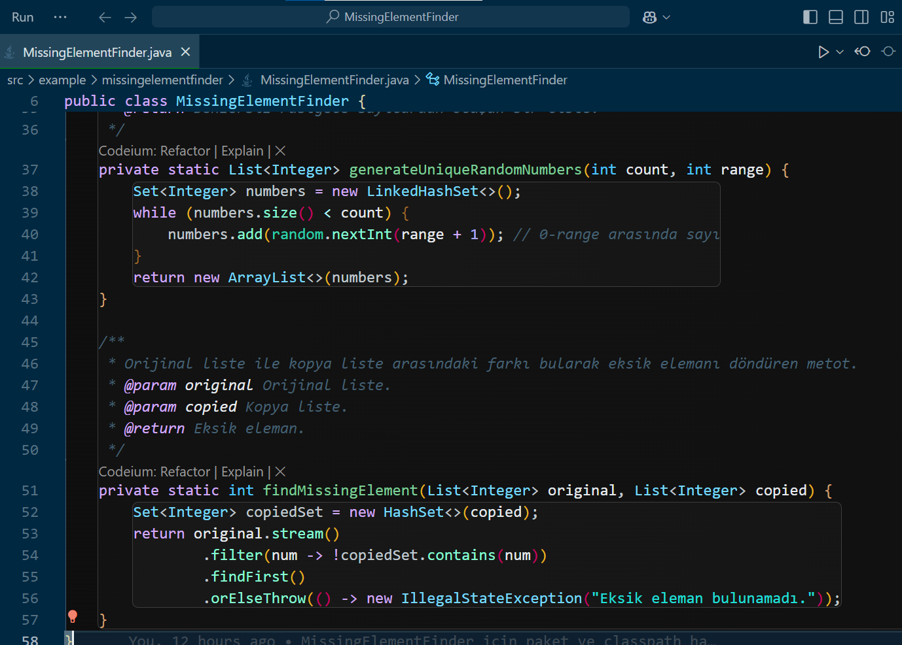

# Missing Element Finder

Bu proje, bir orijinal liste ile kopya liste arasındaki eksik elemanı bulmayı amaçlayan bir Java uygulamasıdır. Program, 100 adet benzersiz rastgele sayıyı içeren bir liste oluşturur, ardından bu listenin bir kopyasını alır ve kopya listeden rastgele bir eleman siler. Son olarak, eksik eleman bulunarak kullanıcıya loglanır.

## Proje İçeriği

Bu proje şu adımları gerçekleştirir:

1. **Orijinal Liste Oluşturulması**: 0 ile 100 arasında benzersiz rastgele 100 sayıdan oluşan bir liste oluşturulur.
2. **Kopya Liste Oluşturulması**: Orijinal listenin bir kopyası alınır.
3. **Rastgele Eleman Silme**: Kopya listeden rastgele bir eleman silinir.
4. **Eksik Elemanın Bulunması**: Orijinal liste ile kopya liste karşılaştırılır ve eksik eleman bulunur.

## Kullanım

### Gereksinimler

- Java 8 ve üstü.
- Bir IDE veya komut satırından Java kodu çalıştırabilme yeteneği.

### Adımlar

1. **Proje Dosyasını İndirin**:  
   Bu projeyi indirip bilgisayarınıza klonlayın.
2. **Projeyi Derleyin ve Çalıştırın**:
   ```bash
   javac src/example/missingelementfinder/MissingElementFinder.java
   java -cp src example.missingelementfinder.MissingElementFinder
   ```

### Çıktı

**Program çalıştırıldığında aşağıdaki gibi bir çıktı alırsınız:**

Orijinal Liste: 1'den 100'e kadar olan sayılar.
Kopya Liste: Orijinal listenin kopyası.
Silinen Eleman: Kopya listeden rastgele silinen eleman.
Eksik Eleman: Orijinal listede olup, kopya listede bulunmayan eksik eleman.

### Fonksiyonlar

generateUniqueRandomNumbers(int count, int range)
Bu fonksiyon, belirtilen count kadar benzersiz rastgele sayıyı, range aralığında üretir ve bir liste olarak döndürür.

Parametreler:

count: Üretilecek sayı adedi.
range: Sayıların aralığı (0 ile range arasında).

## Örnek:

List<Integer> randomNumbers = generateUniqueRandomNumbers(100, 100);

## findMissingElement(List<Integer> original, List<Integer> copied)

Bu fonksiyon, orijinal liste ile kopya listeyi karşılaştırarak eksik elemanı bulur.

Parametreler:

original: Orijinal liste.
copied: Kopya liste.

Örnek:
int missingElement = findMissingElement(originalList, copiedList);

### Açıklamalar:

- **Başlıklar**: Her bir başlık proje hakkında belirli bir bilgiyi veya bölümü açıklamak için kullanılır. Örneğin, `# Proje İçeriği` kısmı, projenin ne yaptığına dair genel bir bakış sunar.
- **Adımlar ve Kullanım**: Kullanıcıların projeyi nasıl kullanacağına dair talimatlar sunulur. Bu kısımlar, VS Code ortamında veya komut satırında çalıştırmak isteyen kişiler için açıklamalar içerir.
- **Fonksiyonlar**: `generateUniqueRandomNumbers` ve `findMissingElement` fonksiyonları ile ilgili detaylı bilgi sağlanır.
- **Geliştirme**: Proje üzerinde yapılabilecek geliştirmelere dair fikirler sunulur.

Bu tür bir README dosyası, projenizin amacını, kullanımını ve fonksiyonlarını kullanıcılar için net bir şekilde açıklayarak onları bilgilendirecektir.

## MissingElementFinder



